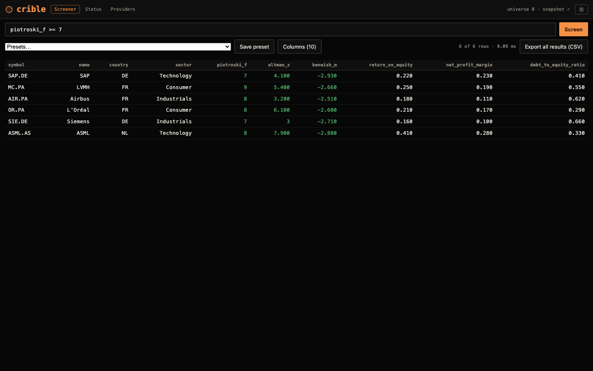
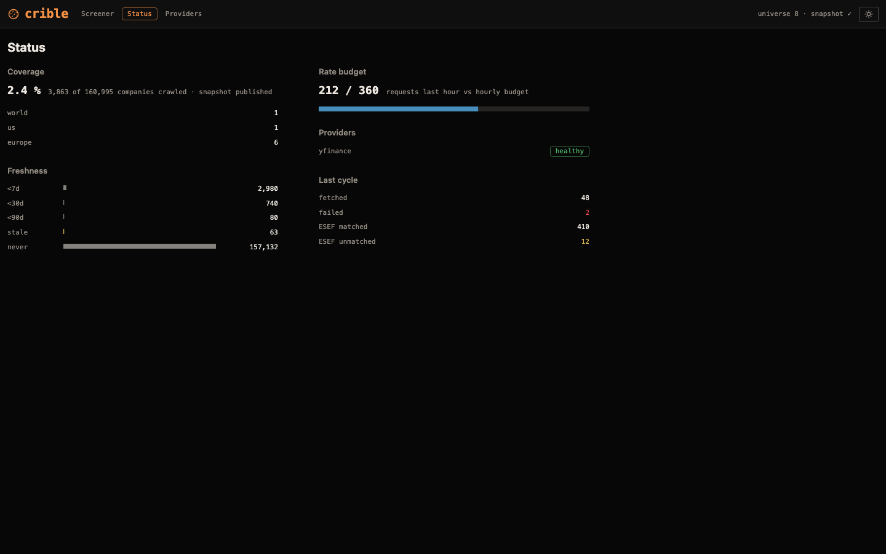
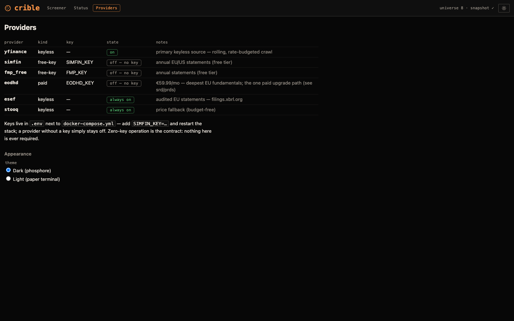
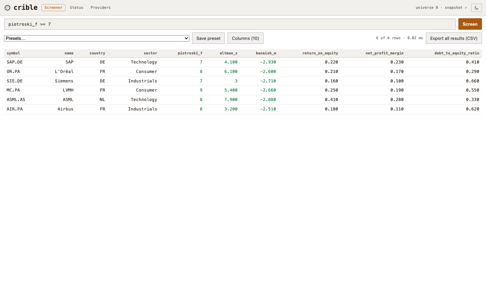

# crible

[](https://github.com/maxgfr/crible/actions/workflows/ci.yml)
[](https://github.com/maxgfr/crible/actions/workflows/pages.yml)
[](https://github.com/maxgfr/crible/releases)
[](LICENSE)

**The fundamental stock screener that runs on your own machine — zero API keys, zero subscription, forever.**

**[Open the screener →](https://maxgfr.github.io/crible/)** — the real screener running entirely in your browser (DuckDB-WASM, open data, no backend).

Screen a worldwide universe of ~150k equities (Europe-depth priority) on real fundamentals —
Piotroski F, Altman Z, Ohlson O, Zmijewski, Beneish M, Montier C, Greenblatt magic formula,
Graham number / NCAV and 150+ transparent ratios — with every number traceable back to its
source. No account, no data vendor, no monthly bill. `docker compose up` and it's yours.


<details><summary>More screens (status, providers, light theme)</summary>




</details>

```bash
# same filter DSL in CLI, API and UI — results in milliseconds
crible screen "return_on_equity > 0.15 AND piotroski_f >= 7 AND country IN ('FR','DE')"
crible screen "magic_formula_rank >= 80 AND zmijewski_score < 0 AND montier_c <= 1"
```

## Why crible

Serious fundamental screening is otherwise a paid SaaS — Stockopedia runs €550/year for Europe
(€725 with the US), TIKR and Simply Wall St are monthly subscriptions. The open-source
self-hosted tools track portfolios (Ghostfolio) or are research terminals (OpenBB); **none of
them is a turnkey fundamental screener you host yourself.** crible is that missing piece.

| | crible | Stockopedia | TIKR | Simply Wall St | OpenBB | Ghostfolio |
|---|---|---|---|---|---|---|
| Self-hosted | ✅ | ❌ | ❌ | ❌ | terminal only | ✅ |
| No API key / no subscription | ✅ | ❌ €550+/yr | ❌ | ❌ freemium | partial | ✅ |
| Fundamental screener (full universe) | ✅ | ✅ | ✅ | partial | ❌ | ❌ |
| Transparent scores → provenance | ✅ | ✅ | ✅ | ❌ | — | — |
| Your data, your machine | ✅ | ❌ | ❌ | ❌ | ✅ | ✅ |

_Honest comparison: the paid tools have deeper history, analyst estimates and polish. crible's
bet is ownership + transparency + zero cost for the fundamental-screening job._

## Quickstart (self-host)

```bash
git clone https://github.com/maxgfr/crible && cd crible
docker compose up          # ingest + api, one shared volume — no keys needed
# open http://localhost:8000  (dense, dark-first grid; light "paper terminal" toggle)
```

Prebuilt multi-arch images (amd64 + arm64 — VPS, Apple Silicon, ARM NAS) ship with every
release; `docker compose pull` fetches them instead of building locally:

```bash
docker pull ghcr.io/maxgfr/crible:latest   # or pin a version: ghcr.io/maxgfr/crible:vX.Y.Z
```

> Upgrading from `v0.1.0`? The image now runs as a non-root user (uid 1000).
> Existing data volumes created by the old root image need a one-time
> `docker compose run --rm --user root api chown -R 1000:1000 /data`.

The first run bootstraps the universe and starts a rate-budgeted, Europe-first crawl; the
screener shows live progress until the first rows land. See the **Status** view for coverage,
freshness and provider health.

### Standalone CLI — no clone needed

crible is a regular Python CLI (`[project.scripts]`); install it as a tool and run it anywhere
(uv auto-provisions the required Python 3.12):

```bash
uv tool install git+https://github.com/maxgfr/crible    # or one-shot: uvx --from git+https://github.com/maxgfr/crible crible …
crible --data-dir ~/.crible-data bootstrap                # pull the FULL published dataset — no crawl
crible --data-dir ~/.crible-data screen "price_to_earnings_ratio <= 15 AND region = 'europe'"
crible --data-dir ~/.crible-data fields                   # every filterable column + type
```

`--data-dir` (or `CRIBLE_DATA_DIR`) selects the dataset location; the default is `./data`
relative to the current directory — outside a clone, always pass it.

Agents can screen through MCP — a read-only tool surface (`screen`, `fields`, `presets`,
`company`, `status`) over stdio:

```bash
claude mcp add crible -e CRIBLE_DATA_DIR=$HOME/.crible-data -- crible mcp
```

The repo also ships a [`crible-cli` agent skill](.claude/skills/crible-cli/SKILL.md) that
teaches coding agents the full CLI — screening syntax, data management, publishing. Install
it once, globally, with the [skills CLI](https://skills.sh) (works for Claude Code and
other agents; re-run `update` anytime to sync with this repo):

```bash
npx skills add maxgfr/crible -g     # install into ~/.claude/skills
npx skills update -g -y             # pull the latest version from the repo
```

Uninstalling: `crible clean` deletes the dataset directory (with a marker guard so a
mistyped `--data-dir` never removes an arbitrary folder), then remove the tool itself:

```bash
crible --data-dir ~/.crible-data clean   # or clean --yes to skip the prompt
uv tool uninstall crible                 # pipx uninstall crible, if installed that way
claude mcp remove crible                 # only if the MCP server was registered
```

### Start with data — zero crawl

The nightly refresh publishes its open dataset as assets on the rolling
[`data-latest` release](https://github.com/maxgfr/crible/releases/tag/data-latest).
A fresh install can pull it and screen immediately:

```bash
uv run crible bootstrap                      # data/ restored from the published dataset
uv run crible screen "piotroski_f >= 7"     # rows, right now — no crawl needed
```

The normal ingest loop then extends the dataset from wherever the bootstrap left it.

**Keeping the data fresh** — pick one:

- `docker compose up` — the `ingest` service is the built-in "cron": a continuous,
  rate-budgeted crawl loop that recomputes and republishes the snapshot after every cycle.
- Your own cron running one bounded pass, e.g. nightly:
  `17 2 * * * cd crible && uv run crible refresh --deadline 9000` (exactly what the
  GitHub Action does).
- Consume-only (no crawling at all): re-pull the published nightly dataset with
  `crible bootstrap --force` on a cron — the `data-latest` release is refreshed every night
  by this repo's Action.

### Running on a NAS (Synology / Docker)

crible is a two-container Compose stack (`ingest` + `api`) sharing one named volume — it drops
straight onto a Synology NAS, Unraid, or any Docker host:

1. Copy the repo (or just `docker-compose.yml` + built image) to the host.
2. `docker compose up -d` — the `api` service listens on `${CRIBLE_PORT:-8000}`; the `crible-data`
   volume persists the Parquet snapshot across restarts.
3. Point your reverse proxy (or the NAS's) at the `api` container.

> **Deploy on a private network.** The API ships **without authentication** — it's designed for
> single-user, private-LAN or reverse-proxied use. Do **not** publish port 8000 straight to the
> public internet; put it behind your reverse proxy / VPN, or bind it to loopback. (OWASP A05.)

## Surfaces

- **CLI** — `crible screen`, `export`, `presets`, `status`, `ingest`, `compute`.
- **HTTP API** — FastAPI; the SPA is served from the same origin in production.
- **SPA** — React/Vite dense grid, a query builder over every snapshot column (typed
  operators, AND/OR groups) that composes the same DSL, company drawer with score
  breakdowns + provenance, theme toggle.

## Data & scores (all keyless)

- **Universe**: [FinanceDatabase](https://github.com/JerBouma/FinanceDatabase) (151,170 equities at the July 2026 refresh, 117 countries).
- **Data**: Yahoo via [yfinance](https://github.com/ranaroussi/yfinance) (rolling, rate-budgeted, a
  resilient *fallback*) · **audited** figures that outrank scraped values at reconciliation —
  US from [SEC EDGAR](https://www.sec.gov/search-filings/edgar-application-programming-interfaces)
  companyfacts **+ Financial Statement Data Sets** (deep history, public domain), EU from
  [filings.xbrl.org](https://filings.xbrl.org) (ESEF), UK from **Companies House** (iXBRL),
  BR from **CVM** (DFP, ODbL) and TW from the **TWSE OpenAPI**. ECB rates via
  [Frankfurter](https://frankfurter.dev) add `*_eur` columns for cross-currency screens.
- **Local-first**: bulk archives are mirrored to `data/mirror/` with a *last-good* guarantee —
  ingestion reads the local mirror, degrades gracefully when a source is down, and a refresh can
  run fully offline. See [`docs/DATA-SOURCES.md`](docs/DATA-SOURCES.md) for the two dataset tiers
  (fully-free vs assumed-risk).
- **Ratios & scores**: [financetoolkit](https://github.com/JerBouma/FinanceToolkit) (150+ ratios,
  Piotroski F, Altman Z) + in-house **distress** models (Ohlson O, Zmijewski), **earnings-quality**
  flags (Beneish M, Montier C) and a **value** toolkit (Greenblatt magic-formula rank, Graham number
  & NCAV net-net, EBITDA / FCF quality) — each tested against hand-computed examples and decomposed
  in the company drawer. Every formula, interpretation and caveat is written up (EN/FR) in
  [`docs/INDICATORS.md`](docs/INDICATORS.md).
- **Engine**: DuckDB over Parquet — full-universe screens in milliseconds.

The full public-data audit — every source, its access mode and license terms, plus the
evaluated-and-rejected candidates (e.g. Google Finance, whose official API shut down in 2012) —
lives in [`docs/DATA-SOURCES.md`](docs/DATA-SOURCES.md).

### How the composite rank is built (FR-015)

`composite_rank` (0-100) blends three percentile pillars, each ranked within the
company's peer group (region×sector when it holds ≥ 5 companies, otherwise the
whole snapshot — the group is named in `rank_peer_group`):

- **quality** = mean pct(`piotroski_f` ↑, `altman_z` ↑)
- **value** = mean pct(`earnings_yield` ↑, `price_to_book_ratio` ↓)
- **momentum** = pct(`return_6m` ↑, trailing 6-month price return)

A pillar with any missing input stays **NULL — never imputed** — and the omission
is recorded in `rank_missing_pillars`; the composite blends the available pillars.
Unlike proprietary StockRanks, every rank decomposes in the company drawer down
to its component values. Ranks are computed at snapshot build time: after
upgrading, run `crible compute` (or wait for the next crawl cycle) to get the
columns.

A standalone **`magic_formula_rank`** (Greenblatt) is published alongside — the same
peer-group percentile blend, over earnings yield (EBIT/EV) and return on capital — but
kept out of `composite_rank` so the quality/value/momentum blend stays stable.

## The hosted screener — how it works

The [hosted screener](https://maxgfr.github.io/crible/) is not a video or a mock: it is the real
screener running **entirely in your browser**. The same filter DSL is compiled client-side (a
TypeScript port, golden-locked to the Python compiler by shared test vectors) and executed by
**DuckDB-WASM** over Parquet artifacts fetched with HTTP range requests from GitHub Pages —
there is no backend at all. Nothing here is unavailable when you self-host; the site *is* the
product, running on the published dataset.

- **Open data, nightly**: a GitHub Action refreshes the dataset every night from the same
  keyless sources the self-hosted crawl uses — FinanceDatabase (the full ~150k-listing universe,
  searchable), Yahoo via yfinance, SEC EDGAR (audited US statements, public domain) and
  filings.xbrl.org (audited ESEF statements) matched through the GLEIF ISIN→LEI file. No key,
  no account, anywhere. The same dataset is downloadable (`crible bootstrap`).
- **Worldwide universe**: the full ~150k-listing FinanceDatabase universe (117 countries) is
  searchable from the first load — this is a worldwide screener, not a US one. Every listing
  deep-links its company drawer whether or not it has been crawled yet.
- **Coverage**: audited fundamentals span the **entire US market** (~10k issuers via the nightly
  EDGAR bulk sweep — price-free scores where Yahoo prices are missing) and the European filers
  (ESEF), on top of the Europe-first rolling crawl (CAC 40 + DAX 40 and outward). Self-hosting
  runs the same worldwide crawl from the same code.
- **Daily price series**: alongside the fundamentals, the site ships the crawled daily OHLCV
  series (~400-day window) as size-bounded Parquet shards — worldwide, not US-only (the
  yfinance Europe/US crawl, the weekly defeatbeta US dump plus optional Stooq worldwide
  dumps) — so the company drawer draws a real 1-year price chart, not just derived ratios.
- **Last-good guarantee**: a refresh that fails or covers too few symbols never publishes —
  the site keeps the previous dataset, and its Status view shows data freshness honestly.

## Status

Built test-first: every behavior is proven by an FR-tagged test (`tests/test_fr004_dsl.py`
proves FR-004, and so on), and the DSL compiler is locked to its TypeScript port by shared
golden vectors. The keyless data-sourcing approach and the two dataset tiers are written up in
[`docs/DATA-SOURCES.md`](docs/DATA-SOURCES.md).

## Documentation

All docs live in [`docs/`](docs/) ([index](docs/README.md)) — the
[indicators & scores reference](docs/INDICATORS.md) (formulas + interpretation, EN/FR), the
[public-data audit](docs/DATA-SOURCES.md), plus [contributing](docs/CONTRIBUTING.md),
[security](docs/SECURITY.md) and the [changelog](docs/CHANGELOG.md).

## Development

```bash
uv sync            # python 3.12 env + deps
uv run pytest      # test suite (FR-tagged)
cd ui && npm i && npm run dev   # SPA dev server on :5173 (proxies /api)
```

## License

MIT
